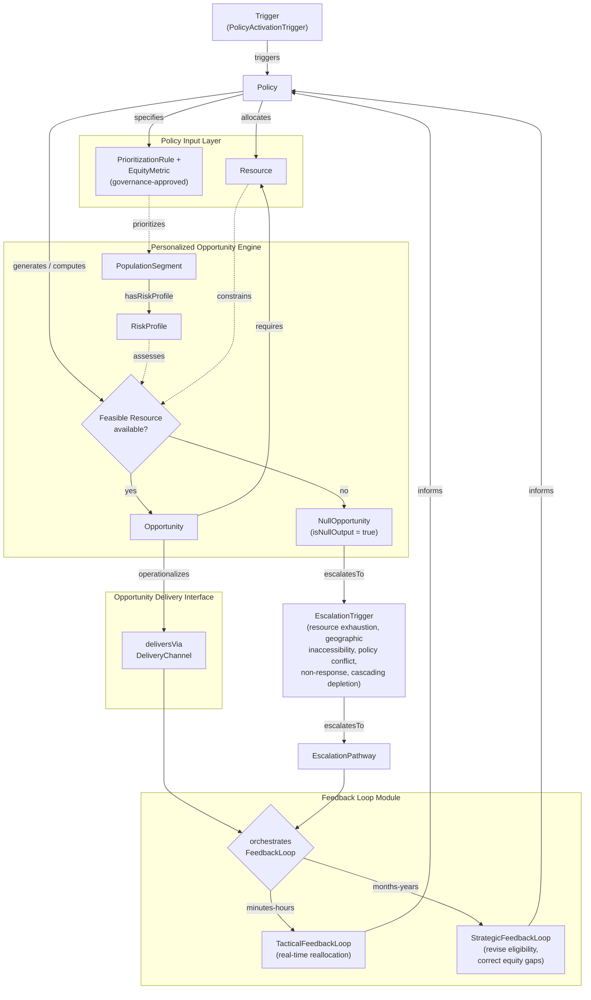

# PAPO-Core Translation Logic (Flowchart)

Renders the PAPO translation/state-transition sequence — what CMDDS Step 3
calls the framework's non-negotiable logic core, which "all downstream
simulations must preserve... even when implementation details differ."

This diagram is **hazard-agnostic**, matching `papo_core_ontology.yaml`.
Edge labels are the actual object property names from that file, so each
arrow is traceable directly back to a formal axiom. A heatwave-specific
instantiation (concrete trigger/resource/channel types from
`papo_heatwave_extension_ontology.yaml`) could be added later as a companion diagram,
following the same core/extension pattern as the ontology files — not
included here to keep this piece technology- and hazard-independent.

## Legend

- **Solid arrows** — primary sequence, each labeled with the object
  property it represents (`triggers`, `generates`, `requires`,
  `escalatesTo`, `operationalizes`, `orchestrates`, `informs`, etc.).
- **Dashed arrows** — auxiliary/cross-cutting relations that hold
  throughout the sequence rather than being a single step in it
  (`assesses`, `constrains`, `prioritizes`).
- **Diamonds** — the two required branch points: whether a feasible
  Resource exists (Step 3 §3 — null output is a required architectural
  outcome, not an error state), and which FeedbackLoop timescale applies
  (Step 3 §5 — tactical vs. strategic loops must not be conflated).
- **Subgraphs** — the four `SystemComponent` classes from
  `papo_core_ontology.yaml` (Policy Input Layer, Personalized Opportunity
  Engine, Opportunity Delivery Interface, Feedback Loop Module). Note the
  cycle closes: both feedback loop types `inform` the Policy Input Layer,
  which is where the sequence began.

## Source

Derived from `papo_core_ontology.yaml` (classes, object properties, and
`subClassOfRestrictions` axioms), which itself formalizes CMDDS Step 3
("Core Translation & State Transition Logic") in hazard-agnostic form.
